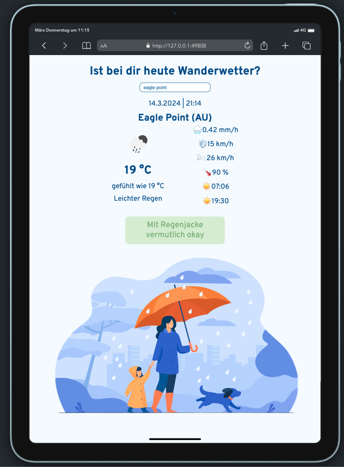
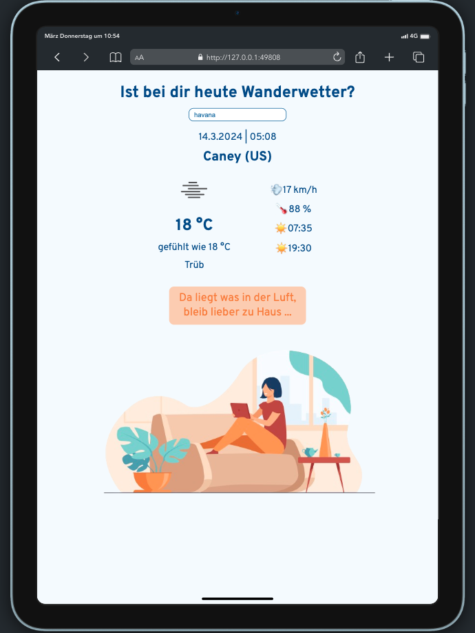
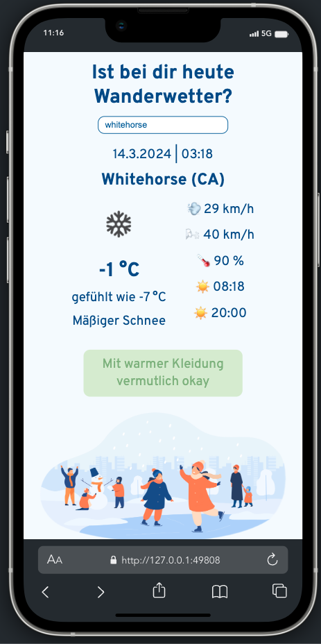

# Wanderwetter

by [Mia Mecklenburg](https://github.com/MiaMarmeladenbrot)

## Task

- Get weather data from [Open Weater](https://openweathermap.org/).
- Build your own design using this data (desktop, tablet and mobile).

## Purpose of the website

- Search by city name for current weather.
- Get suggestions for possible cities while typing.
- Get data about local time, temperature, atmosphere, rain, wind, sunrise, sunset.
- Get hiking advice according to the data, each advice has its own image.

## Screenshots

### Desktop

 
 
 

### Tablet

 
 

### Mobile

 
 
